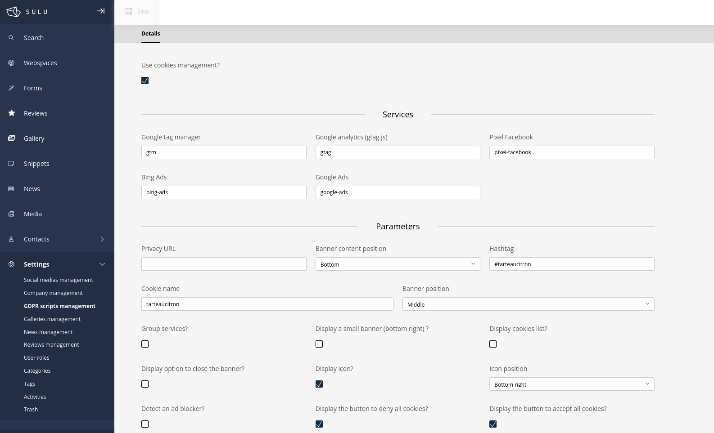
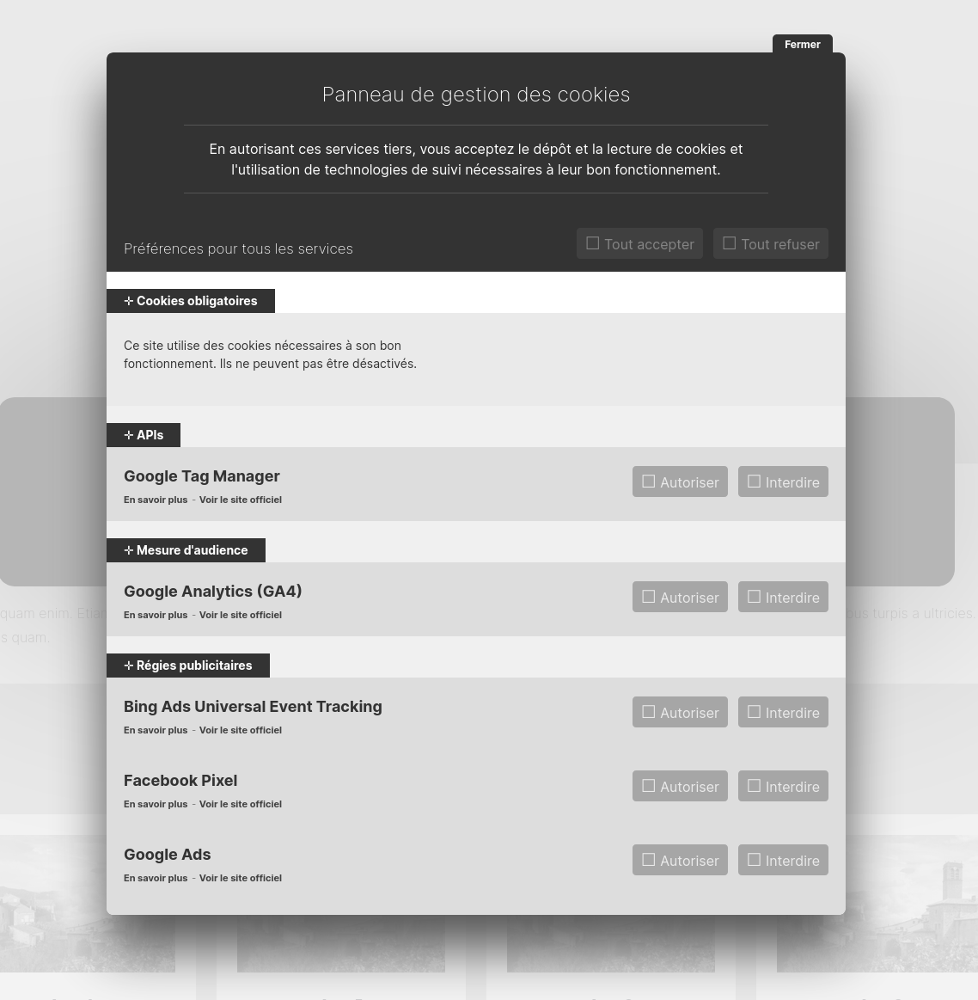

# Sulu GDPR bundle


[](https://sulu.io/)

## Presentation

A Sulu bundle to easily manage the GDPR.
It also allows you to manage the consent banner by using the [Tarteaucitron](https://github.com/AmauriC/tarteaucitron.js/) consent management system.





## Requirements

* PHP >= 8.0
* Sulu >= 2.5.*
* Symfony >= 5.4
* Composer

## Installation

### Install the bundle

Execute the following [composer](https://getcomposer.org/) command to add the bundle to the dependencies of your
project:

```bash
composer require pixelopen/sulu-gdprbundle
```

### Enable the bundle

Enable the bundle by adding it to the list of registered bundles in the `config/bundles.php` file of your project:

 ```php
 return [
     /* ... */
     Pixel\GDPRBundle\GDPRBundle::class => ['all' => true],
 ];
 ```

### Update schema (for dev environnement)
```shell script
bin/console do:sch:up --force
```

## Bundle Config

Define the Admin Api Route in `routes_admin.yaml`
```yaml
gdpr.setting_api:
  type: rest
  prefix: /admin/api
  resource: pixel_gdpr.settings_route_controller
  name_prefix: gdpr.
```

## Use
The bundle is only composed of the settings, which make the management of the GDPR very easy.

To use the GDPR management of the bundle, just check the "Use cookies management?". All the other options should be display.

The **Services** section will take care to manage the different cookies scripts.

The **Parameters** section will help you manage the Tarteaucitron banner, which displays the consent banner.
There are plenty of parameters, so don't hesitate to visit the repository of Tarteaucitron.


### Twig extension
The bundle comes with two twig functions:

**gdpr_settings()**: returns the settings of the bundle. No parameters are required.

Example of use:
```twig

{{ gdprSettings.useCookiesHandleing }}
```

**gdprScripts()**: renders the consent banner. No parameters are required.

Example of use:
```twig
{{ gdpr_scripts() }}
```

## Contributing
You can contribute to this bundle. The only thing you must do is respect the coding standard we implements.
You can find them in the `ecs.php` file.
